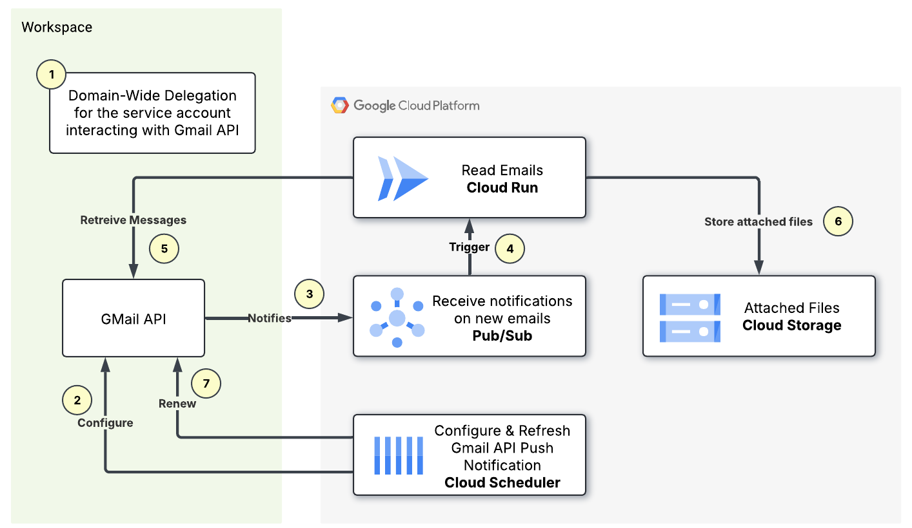

# Automated Gmail Attachment Processing

This project provides a seamless, one-click deployment to automate the processing of incoming emails for a Google Workspace email address. It extracts attachments from new emails and uploads them to a Google Cloud Storage bucket.

The solution uses domain-wide delegation to authorize a service account to access the user's mailbox, ensuring that the process is secure and does not require user passwords.

## Architecture

The following diagram illustrates the architecture of the system:



The process flow is as follows:

1.  **Gmail Push Notifications**: The Gmail API is configured to send a push notification to a **Google Cloud Pub/Sub** topic whenever a new email arrives in the monitored inbox.
2.  **Eventarc Trigger**: An **Eventarc** trigger is subscribed to the Pub/Sub topic. When a new message is published, Eventarc invokes the **Cloud Run** service.
3.  **Cloud Run Service**: A Python Flask application running on Cloud Run receives the notification.
4.  **Gmail API Access**: The application uses a service account with domain-wide delegation to access the Gmail API on behalf of the user. It uses **Datastore** to track the last processed email to avoid duplicates.
5.  **Attachment Processing**: The application fetches the new email, extracts any attachments, and uploads them to a **Google Cloud Storage** bucket. The service account key for this is securely stored in **Secret Manager**.
6.  **Scheduled Renewal**: A **Cloud Scheduler** job runs weekly to call an endpoint on the Cloud Run service to renew the Gmail push notification subscription, which expires every 7 days.

## Prerequisites

Before you begin, ensure you have the following:

*   **Google Cloud SDK (gcloud)**: Installed and authenticated. You can find installation instructions [here](https://cloud.google.com/sdk/docs/install).
*   **Terraform**: Installed. You can find installation instructions [here](https://learn.hashicorp.com/tutorials/terraform/install-cli).
*   **Google Cloud Project**: A Google Cloud project with billing enabled.
*   **Google Workspace Account**: A Google Workspace account with administrator access to configure domain-wide delegation.

## Deployment

The deployment is automated via a single script.

1.  **Configure the Deployment:**

    Open the `installation_scripts/setup.sh` file and modify the following global variables at the top of the file:

    ```bash
    # Global variables
    #################################
    PROJECT_ID="your-gcp-project-id"                             # ID of the project where you want to deploy
    REGION="europe-west1"                                       # Name of the region
    AUTH_USER="your_user@example.com"               # User that will run the application
    ARTIFACT_REGISTRY_REPO="email-automation-gcr"               # Name of the Artifact Registry Repository
    TARGET_EMAIL_ADDRESS="email-to-monitor@example.com"    # Name of the email to manager
    SERVICE_NAME="email-automation-service"                     # Name of the Cloud Run Service
    #################################
    ```

2.  **Run the Setup Script:**

    Execute the setup script from the `installation_scripts` directory:

    ```bash
    cd installation_scripts
    ./setup.sh
    ```

3.  **Authorize Domain-Wide Delegation (Manual Step):**

    The script will pause and provide you with a **Client ID**. You need to authorize this client ID for domain-wide delegation in your Google Workspace Admin console.

    *   Go to your Google Workspace Admin console (`admin.google.com`).
    *   Navigate to **Security > Access and data control > API controls**.
    *   In the **Domain-wide delegation** section, click **Manage Domain-wide delegation**.
    *   Click **Add new**.
    *   In the **Client ID** field, enter the Client ID provided by the script.
    *   In the **OAuth Scopes** field, enter the following scopes:
        `https://www.googleapis.com/auth/gmail.readonly,https://www.googleapis.com/auth/gmail.modify`
    *   Click **Authorize**.

    **Note on Authentication:** When using Google Workspace APIs, authentication requires a service account key file. This is because the Workspace authentication server needs the client ID from the key file to verify that the service account has been granted domain-wide delegation permissions. Default application credentials or tokens don't seem to have this information, and the authentication fails.

4.  **Complete the Deployment:**

    Once you have authorized the service account in the Admin console, return to the terminal and press **[Enter]** to continue. The script will then proceed to build the Docker image, and deploy the infrastructure using Terraform.

    Upon completion, the script will output the URL of the deployed Cloud Run service.

## Infrastructure

The `setup.sh` script and Terraform configuration will create the following resources in your Google Cloud project:

*   **Cloud Run Service**: A fully managed service to run the email processing application.
*   **Cloud Storage Bucket**: To store the email attachments.
*   **Datastore Database**: To maintain the state of email processing.
*   **Pub/Sub Topic**: To receive notifications from the Gmail API.
*   **Eventarc Trigger**: To connect the Pub/Sub topic to the Cloud Run service.
*   **Cloud Scheduler Job**: To periodically renew the Gmail push notification subscription.
*   **Secret Manager Secret**: To securely store the service account key.
*   **Service Accounts and IAM Roles**: Necessary service accounts and IAM roles for the components to interact securely.
*   **Artifact Registry Repository**: To store the Docker image of the application.
